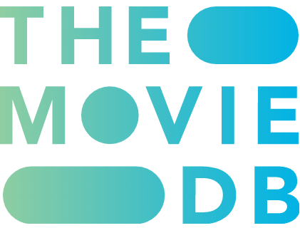
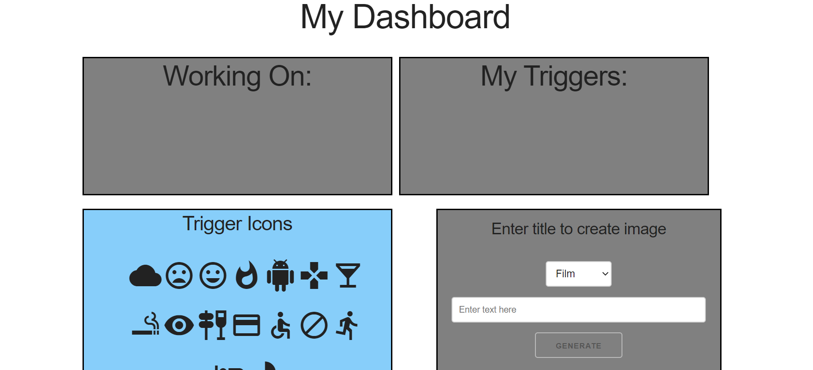

# Trauma Recovery Dashboard

## CSS:
Framework by Skeleton
Icons by GoogleIcons

## API Used
"This product uses the TMDb API but is not endorsed or certified by TMDb."
 

Google Books APi 

Pixabay API: [link](https://pixabay.com/)

## Instructions:

### Create a plan for your recovery from trauma!

Use the 'Trigger Icons' to make a visual map of what you are working on:

Drag and drop any of the 'Trigger Icons' from the Icon Bank to the 'Working On', 'Triggers', or 'Weekly Schedule' areas.  To remove them, simply drag them back to the icon bank; upon refresh, doubles of icons will be erased.

Use the 'Media Generator' to search for 'Film', 'Book', or 'General' images by selecting the media type you want, and entering a title or keyword(s) into the search bar. Click the 'Generate' button to retrieve your image! The generated images can be dragged and dropped to any of the working areas on the page, except the Icon Bank & Delete area, which will remove them.

Create text-based notes using the Note Generator at the top of the 'Your Week' area.
These notes can be dragged and dropped to any of the working areas on the page, except for the Icon Bank, to help keep track of appointments, events, etc.

Upon creation, items will have a delete button attached to them.  Click the 'X' to remove the item from your dashboard completely.

If you refresh the page, or leave and return, you can delete old notes & images by dragging them to the 'Icons Bank & Delete' area.

## Screenshot:

## Link to App:
[Trauma Recovery Dashboard](https://londonlast21.github.io/filmskeleton)

